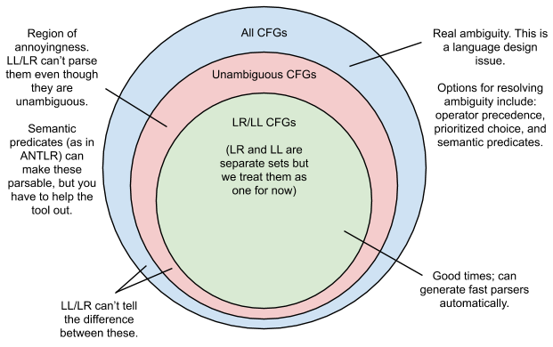

# $LL$ vs. $LR(k)$ parsers:
### What, when and why one should care.
## Oren Friedman

---
# TLDR:
- LL: top down, left recursive
- Worst case exponential complexity, but really NP
- LR: bottom up, right recursive, Polynomial
- you probably don't care unless you do A LOT of parsing
- but it's kind of interesting to understand when and why you might and why things are the way they are

---
# Top-down aka Recursive Descent Parsing

## A language of arithmetic expressions

---
# Top-Down aka Recursive Descent Parsing
- you don't have to think hard to see how it works
- mimics generating a context free string
- take a start symbol, try productions down the parse tree until they termintate
- Given a string of non-terminals, take the leftmost and apply the production
- match your parse tree leaves with the input string
- if it doesn't match, rewind the subtree and try a different derivation
- Left-recursive grammars can't be handled
- Worst case complexity $O(k^n)$

---
# Top-Down parsing with look-ahead
- Naive backtracking recursive descent is potentially so expensive
- $LL(k)$ parsers use $k$-symbol look-ahead to remove ambiguity
1. The stack-top `T` is the start symbol and $0<i = k$
2. `Input` is the next $k-i+1$ text symbols
  - If `T == Input`, pop the stack top and eat the input
3. Otherwise look up `(T, Input)` pair in a rule table
  - If a rule exists such that `(T, Input) -> P`, stack top `T = P` and `i = k`
  - Otherwise, `i = i-1; GOTO 2`
### Still possible to have exponential complexity with blow-up in look up table size (think about an adversarially designed input string)
[Reference](https://en.wikipedia.org/wiki/LL_parser#Concrete_example)

---
# Bottom Up parsing ( $LR(k)$ )
- [We saw this in Hopcroft 7.4: the Cocke, Younger & Kasami algorithm](https://en.wikipedia.org/wiki/CYK_algorithm#/media/File:CYK_algorithm_animation_showing_every_step_of_a_sentence_parsing.gif)


---
# LR(k) parsing
- The parser scans the entire input string in one forward pass
- The stack begins empty and Non-terminals are added that correspond to the current input
- Unlike in top-down (LL) parsing, decisions are made not just based on the stack-top/input pair, but on the **entire** stack and the input
- At each step, the stack symbols are reduced down to keep the stack size small
- This process is known as "shift-reduce" and it is essentially what CYK does
- Lookahead of up to $k$ symbols is also used to handle grammatical ambiguity
- [Reference](https://en.wikipedia.org/wiki/LR_parser#LR_parse_steps_for_example_A*2_+_1)
## If CYK is $O(n^3)$ why do people write Top Down Parsers?

---
# The plot so far:
- LR parsers always do their work in polynomial time.
- LL parsers are at best NP and at worst Exponential.
## So why do almost all modern compiler infrastructures for popular industrial languages use LL parsing?
- GCC (G++), Clang, Go, Javac, etc...
- GCC actually used to use a LR parser but [switched](https://gcc.gnu.org/wiki/New_C_Parser)
## This seems to fly in the face of what we have learned about computational complexity

---
# TLDR:  It's because if you want to write a bottom up LR parser, it's too hard to write it by hand

## [Recursive Descent C Parser](https://github.com/gcc-mirror/gcc/blob/ad9db543abb523cd97f1aa5af78a72188c01aa6e/gcc/c/c-parser.c#L2615-L2900)

### It's not that complicated, basically what you wrote in your PL class:
```
while(true) { 
    switch(input) { 
        case 'a': do_stuff(); ... 
    }
}
```

---
# Why do we need parser generators for practical $LR$ parsers?
- Because essentially, they do the reverse of $LL$ parsers:
  - While $LL$ parsers just rely on the top stack symbol and an input to transition
  - $LR$ parsers have to calculate transitions from the whole stack plus an input
  - An $LR(1)$ parser generator takes a grammar and builds huge tables
    - essentially these define the transitions for all possible stack states
## [Now, compare that $LL$ parser from before to a $LR(3)$ C compiler](https://github.com/gcc-mirror/gcc/blob/a02b08955f97eacca8261c2d57b08c7f5d287cc6/gcc/c-parse.c#L143-L3944)

---
# Some examples of LR parser generator tools
- [**Yacc**: developed for Unix at Bell, based on Knuth's seminal work on LR parsing](http://bxr.su/OpenBSD/usr.bin/yacc/)
- [**Bison**: developed for GNU/Linux by the Free Software Foundation](https://en.wikipedia.org/wiki/GNU_Bison)
- [SLY: written in Python, tries to improve LR parsing UX](https://sly.readthedocs.io/en/latest/)
- PGen
- Lark, and so, so many others...
## It's almost a rite of passage for compiler students...
- They all work in a similar way, with slightly different algorithms
- Their goal is to build the parsing tables for all possible stack configurations
---
# You feed it a EBNF or PEG grammar and it gives you the world
- There are industry standard formats for grammars (like Greibach, etc.)
- If you look at [CPython](https://github.com/python/cpython/tree/master/Parser) and try to find a Python parser, you wont
  - you'll see PGen and C files
### These tools are amazeballs, but they have their limitations:
- Hard to debug generated code
- get good error messages
- Hard to reason about intuitively to do hand optimization which is sometimes the only way

---
# Drawbacks of LR stem from the Automated Tooling
- Since the tables are all created by an automated process it's difficult for the developer to insert rich human readable debugging information without dealing with and adding a large amount of complexity to an already complex tool
## Therefore, we end up with LL parsing tools written by hand
- Top down parsing is easier to reason about
- Writing it by hand lets you hand-roll optimizations
- Let's you really get down and dirty with edge cases
  - optimizations
  - compiler error messages (love tears god emoji)

---
# There also exist some LL parser generator tools
## [Antlr](https://www.antlr.org/about.html)
- Antlr is extremely cool, in many ways it combines the best of both worlds by automatically generating a performant, correct and human readable parser with good error messaging

# There are even modern LR generators that do the same thing as ANTLR

## [Lark](https://github.com/lark-parser/lark) automatically creates human readable debugging info

---
# So...     ¯\\\_(ツ)_/¯   ...?
- So, I just talked for like 20 minutes about the differences between LL/LR
- And in terms of performance, in the big picture of a compiler infrastructure:
## Parsing doesn't matter much for languages you care about
- C, C++, Java: you develop your code, compile it a few hundred times, maybe
- Then just distribute the executables

---
# Also, C, C++, Java, (insert your favorite language):
# :open_mouth: ARE NOT CONTEXT FREE :open_mouth:
- most of their syntax is... but there are major ambiguities which require machinery going beyond a stack machine to deal with.

```
x * y;
```

- Valid C/C++: what does it do?

---
# Nope

```
...

typedef int x;

...

x * y;

...
```
Hooray, it's a variable declaration!

## We need things like awareness of symbols and variables
- This requires something that goes beyond context free languages

---
# In fact...


---
# LL and LR parsers are really restricted
## A naive / pure implementation of what we learned only parses a subset of Context Free Languages
- in order to do anything real (aka handle grammar ambiguities) you need to do more work
- our nice happy context free parsing algorithm in deterministic $O(n^3)$ time can't handle real programming languages

---
# SEMANTIC ANALYSIS IS HARD
- maybe even exponential in the size of the input
- or at least NP with a very large constant factor
- Semantic analysis is extremely important for your typical C style programming language
  - building your attribute grammar
  - checking type correctness
  - memory safety checking by the compiler (Rust)
  - garbage collection algorithms
## Who really gives a damn whether the parser is $O(n^3)$?

---
# Starting to see the bigger picture...
### Compiler infrastructures are such complex pieces of software, it helps to have a parser designed in a way that can be reasoned about:
- debugging
- optimization
- enhanced with rich user feedback
### Top down parsing may be slower than bottom up, but not by much
### Other work that "real" compilers do is slower than $O(n^k)$

---
# Where might deterministic parsing time matter?
[Interpreted languages where the parsing is much of the work or run repeatedly on interpreters without compilation to machine language](https://en.wikipedia.org/wiki/GNU_Bison#Use)
  - Ruby, Python, PHP, JavaScript (this is complicated)
  - Bash
  - *SQL engines
  - JSON & HTML parsers
  - GPL Languages that are very regular or context free:
    - Lisps!

### Implementations of these use $LR(k)$ parsers
Deterministic $O(n^k)$ buys you more here because you parse a ton of this stuff.

---
# So where does LL vs. LR parsing really matter?
- It probably doesn't in your life
- Maybe in small simple languages
  - query languages
  - DSL's
  - Markup/Down/Around languages
- Things that get processed repetitively over and over
- Not giant C++ programs that get distributed as binaries
- You get a fast computer, compile it and forget about it
- Who cares if it's $O(K^N)$?

---
# Thanks
### orenwf@gmail.com

---
# References
- [Aho, Sethi, Ullman: Compilers](https://www.pearson.com/us/higher-education/program/Aho-Compilers-Principles-Techniques-and-Tools-2nd-Edition/PGM167067.html)
- [Cooper, Torczon: Engineering a Compiler](https://www.elsevier.com/books/engineering-a-compiler/cooper/978-0-12-088478-0)
- [LL and LR in Context Blog Post](http://blog.reverberate.org/2013/09/ll-and-lr-in-context-why-parsing-tools.html)
- [Parser Generator Wiki](https://en.wikipedia.org/wiki/Comparison_of_parser_generators)
- [StackOverflow: Terence Parr](https://stackoverflow.com/questions/4092280/what-advantages-do-ll-parsers-have-over-lr-parsers?rq=1)
- [StackOverflow: Ira Baxter](https://stackoverflow.com/questions/6319086/are-gcc-and-clang-parsers-really-handwritten)
- [WikiPedia: LL Parsing](https://en.wikipedia.org/wiki/LL_parser)
- [WikiPedia: Top-Down Parsing](https://en.wikipedia.org/wiki/Top-down_parsing)
- [ANTLR: $LL(k)$ Parser Generator](http://citeseerx.ist.psu.edu/viewdoc/download?doi=10.1.1.57.881&rep=rep1&type=pdf)
- [WikiPedia: $LR(k)$ Parsing](https://en.wikipedia.org/wiki/LR_parser)
- [Josh Haberman Blog](http://blog.reverberate.org/2013/07/ll-and-lr-parsing-demystified.html)